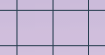
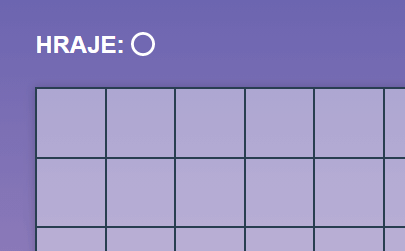
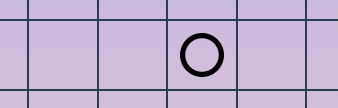

# Úkol: Piškvorky 4/5

Tento úkol přímo navazuje na [Piškvorky 3](https://github.com/Czechitas-podklady-WEB/Ukol-Piskvorky-3).

## Zadání

1. Pokračuj v repozitáři `piskvorky`.

1. Tvým úkolem bude reagovat na uživatelův výběr políčka. Podle toho, kdo je na tahu, budeš přidávat do herní plochy kolečka nebo křížky a v levém horním rohu zobrazovat, čí tah následuje.

1. Přidej javascriptový soubor a napoj ho do stránky `hra.html`.

1. Vytvoř si proměnnou, ve které bude uloženo kdo je na tahu. Začíná vždy kolečko, tak rovnou do proměnné přiřaď hodnotu `circle`.

1. Pomocí posluchače událostí po kliknutí na políčko:

   1. Přidej políčku příslušnout třídu podle toho, kdo je zrovna na tahu. Například `board__field--circle`, resp. `board__field--cross`.

   1. Nastyluj políčka tak, aby nezobrazovala nic nebo kolečka a křížky podle tříd z předchozího kroku.

      

   1. Výchozí rámeček, který se objevuje po kliknutí na tlačítko, není potřeba stylovat. Může se uživateli hodit pro snazší ovládání z klávesnice.

   1. Změň hodnotu proměnné z `circle` na `cross`, případně z `cross` na `circle`.

   1. Uprav v levém horním rohu výpis, kdo je na tahu.

      

   1. Nereaguj, pokud v kliknutém políčku už je nějaký symbol.

### Bonus

- Zamez, aby na již vyplněná políčka se nešlo dostat klávesou `tab` přidáním atributu `disabled`.

  

- Pomocí animací přidej symbolům efekt postupného zvětšení. V náhledu je animace zpomalená z času `0.15s` na `0.45s`, aby bylo lépe vidět, jak má vypadat. Ve výsledku použij kratší čas.

  
