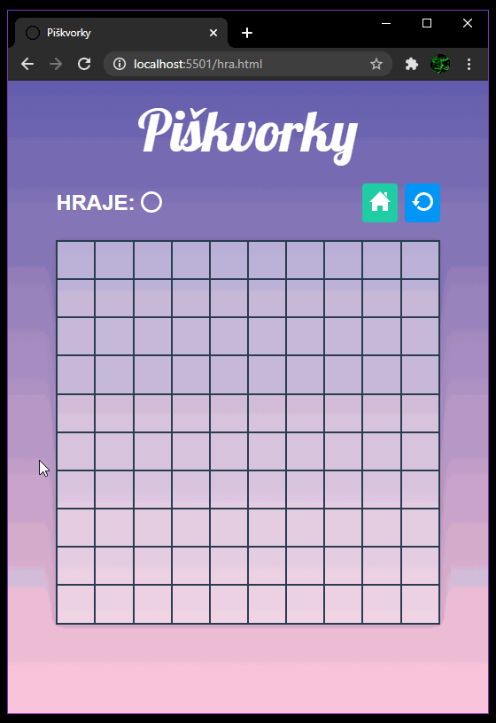
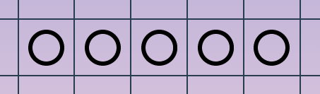
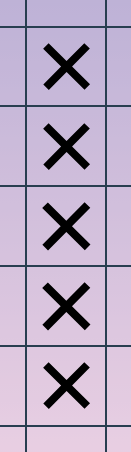
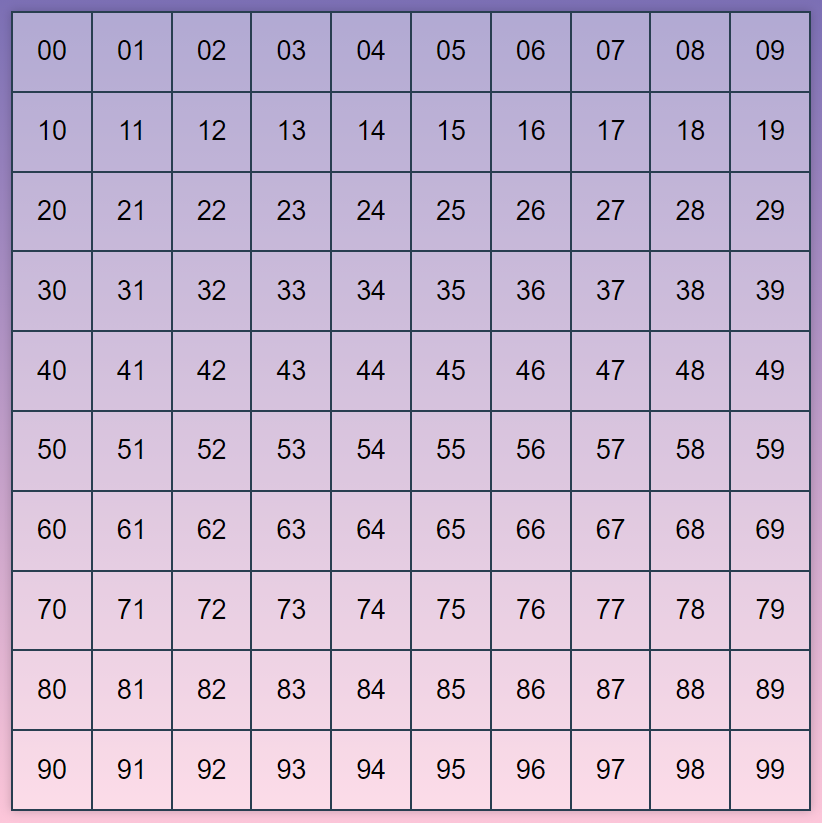
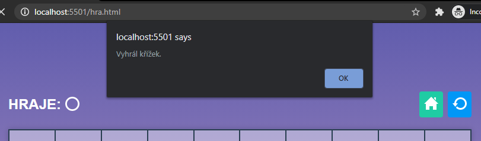
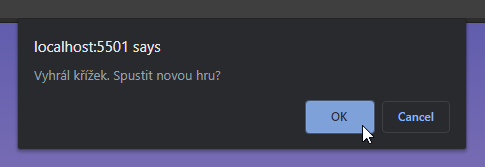
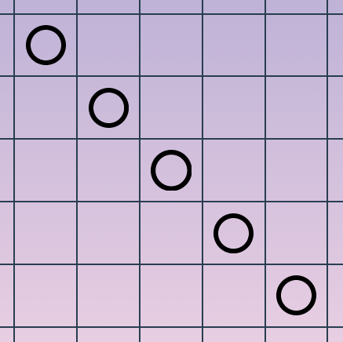

# Úkol: Piškvorky 5/5

Před tebou je závěrečný úkol, který přímo navazuje na [Piškvorky 4](https://github.com/Czechitas-podklady-WEB/Ukol-Piskvorky-4). Tvým úkolem bude kontrolovat, jestli jeden z hráčů nevyhrál.



## Zadání

1. Pokračuj v repozitáři `piskvorky`.

1. V základní variantě počítej, že hráč vyhrál, pokud má pět symbolů v řadě vedle sebe nebo ve sloupci pod sebou.

   
   

1. Pro detekci výherního tahu budeš potřebovat několik pomocných funkcí.

   1. Napiš funkci `getPosition(field)`, která pro dané políčko vrátí objekt s číslem řádku a sloupce. Pro levé horní políčko vrať `{row: 0, column: 0}`, pro pravé dolní `{row: 9, column: 9}`, pro levé dolní `{row: 9, column: 0}`, …

      <details>
      <summary>Nápověda</summary>

      ```javascript
      const boardSize = 10 // 10x10
      const fields = document.querySelectorAll('.board__field') // Selektor pozměň tak, aby odpovídal tvému kódu.

      const getPosition = (field) => {
      	let fieldIndex = 0
      	while (fieldIndex < fields.length) {
      		if (field === fields[fieldIndex]) {
      			break
      		}
      		fieldIndex++
      	}

      	return {
      		row: Math.floor(fieldIndex / boardSize),
      		column: fieldIndex % boardSize,
      	}
      }
      ```

      </details>

      Kód v nápovědě předpokládá následují pořadí políček v html:

      

      První cifra odpovídá řádku, druhá sloupci.

   1. Napiš funkci `getField(row, column)`, která naopak pro číslo řádku a sloupce vrátí příslušný prvek.

      <details>
      <summary>Nápověda</summary>

      ```javascript
      const getField = (row, column) => fields[row * boardSize + column]
      ```

      </details>

   1. Přichystej si funkci, `getSymbol(field)`, která pro políčko s křížkem vrátí řetězec `'cross'`, pro kroužek `'circle'` a pro neobsazené políčko hodnotu `undefined`.

      <details>
      <summary>Nápověda</summary>

      ```javascript
      const getSymbol = (field) => {
      	// Název třídy přizpůsob tvému kódu.
      	if (field.classList.contains('board__field--cross')) {
      		return 'cross'
      	} else if (field.classList.contains('board__field--circle')) {
      		return 'circle'
      	}
      }
      ```

      </details>

1. S použitím nachystaných funkcí zjisti při každém tahu, jestli se nejedná o výherní. Nový kód navaž na event listener ze čtvrtého úkolu.

   1. Vytvoř funkci `isWinningMove(field)`, která se podívá na symbol políčka a zjistí, jestli jich je v řádku nebo ve sloupci sousedících pět. Podle toho vrátí `true` nebo `false`.

       <details>
       <summary>Nápověda</summary>

      ```javascript
      const symbolsToWin = 5
      const isWinningMove = (field) => {
      	const origin = getPosition(field)
      	const symbol = getSymbol(field)

      	let i

      	let inRow = 1 // Jednička pro právě vybrané políčko
      	// Koukni doleva
      	i = origin.column
      	while (i > 0 && symbol === getSymbol(getField(origin.row, i - 1))) {
      		inRow++
      		i--
      	}

      	// Koukni doprava
      	i = origin.column
      	while (
      		i < boardSize - 1 &&
      		symbol === getSymbol(getField(origin.row, i + 1))
      	) {
      		inRow++
      		i++
      	}

      	if (inRow >= symbolsToWin) {
      		return true
      	}

      	let inColumn = 1
      	// Koukni nahoru
      	i = origin.row
      	while (i > 0 && symbol === getSymbol(getField(i - 1, origin.column))) {
      		inColumn++
      		i--
      	}

      	// Koukni dolu
      	i = origin.row
      	while (
      		i < boardSize - 1 &&
      		symbol === getSymbol(getField(i + 1, origin.column))
      	) {
      		inColumn++
      		i++
      	}

      	if (inColumn >= symbolsToWin) {
      		return true
      	}

      	return false
      }
      ```

       </details>

   1. Funkci `isWinningMove` pusť s každým nově přidaným symbolem.

   1. Pokud vrátí `true`, zobraz `alert` s hláškou, který hráč vyhrál.

      

### Bonus

- Při výhře místo alertu zobraz `confirm`. Pokud uživatel klikne na `Ok`, načti znovu stránku zavoláním `location.reload()`.

  

- Jako výhru počítej i pět stejných symbolů na diagonále.

  
